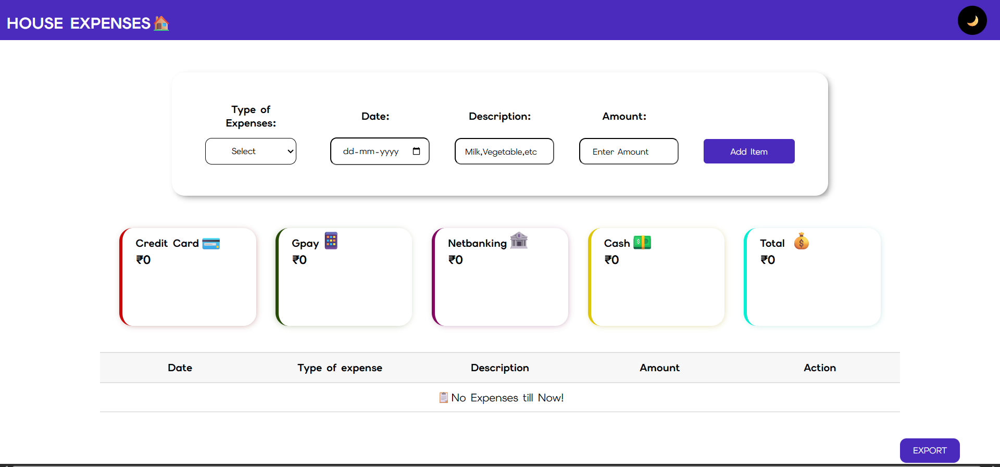
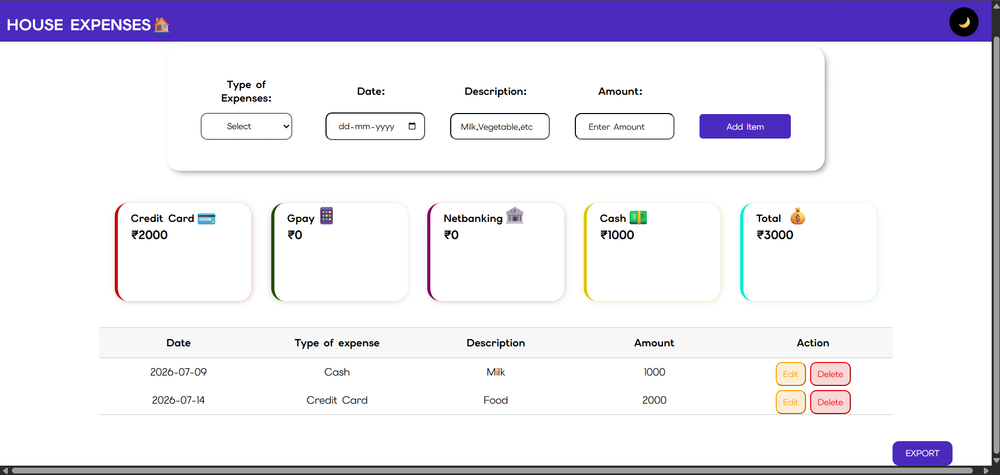
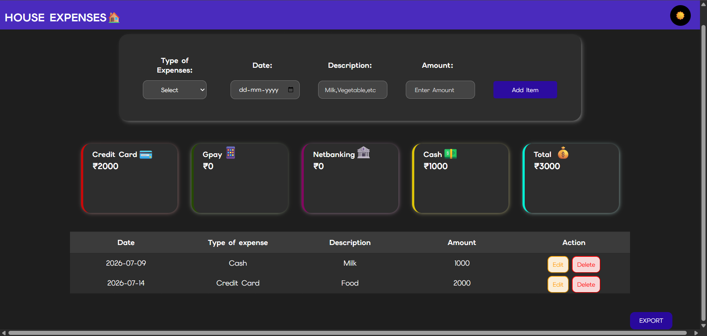

# 💰 Expense Tracker

A responsive Expense Tracker web application built using HTML, CSS, and JavaScript. The application allows users to manage daily expenses, stores data using Local Storage, and supports CSV export.

## ✨ Features

- Add expenses
- Edit expenses
- Delete expenses
- Persistent data with Local Storage
- Payment-wise expense totals
- Grand total calculation
- CSV export
- Dark mode
- Responsive design

## 🛠️ Technologies Used

- HTML5
- CSS3
- JavaScript
- Local Storage API

## 📷 Screenshots

## 🚀 How to Run

1. Clone this repository.
2. Open `Expenses.html` in your browser.
3. Start tracking your expenses.

## 🌐 Live Demo

https://pranaya-tech404.github.io/Expense-Tracker/

## 🔮 Future Improvements

- Replace Local Storage with a database (e.g., MySQL or MongoDB) for persistent and scalable data storage.
- Search and filter
- Monthly and yearly reports
- Interactive Charts and analytics
- User authentication

## 👨‍💻 Author

Pranaya